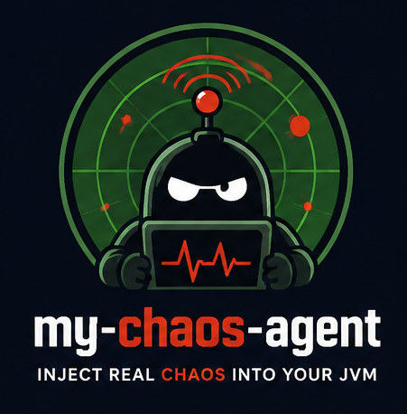

<p align="center">
  
</p>

# my-chaos-agent

[](LICENSE)
[](https://openjdk.org/projects/jdk/21/)

**Flip a switch. Break your app. Learn how it survives.**

my-chaos-agent is a Java agent that lets you break your running JVM application on purpose — injecting latency, exceptions, memory pressure, CPU saturation, and virtual-thread pinning — with **zero code changes and zero restarts**. Attach it via `-javaagent` or at runtime, then flip switches in the embedded web dashboard (`http://localhost:8090`) to simulate real-world failures and watch your app's resilience in real time.

**What is chaos engineering?** It's the practice of deliberately injecting failures into your system to verify it handles them gracefully — before real failures happen in production. Think of it like a stress test for your code's error handling: instead of hoping your retry logic, circuit breakers, and timeouts work, you *prove* they work by triggering the exact conditions they're designed to handle.

Built for Java 21+ and Spring Boot (RestTemplate, WebClient, Feign), it's the fastest way to find bottlenecks before production does.

---

## 🎯 Why Use This? (When & Why)

### What Is This Tool For?

**my-chaos-agent** brings chaos engineering to everyday JVM development. Chaos engineering means deliberately injecting failures (slow networks, crashed dependencies, memory leaks, CPU contention) into your application to verify it survives them. Instead of discovering breaking points during an outage, you discover them on your laptop or in CI.

**Typical use cases:**
- **Resilience validation** — Prove your timeouts, retries, circuit breakers, and fallbacks actually work
- **Performance regression detection** — Catch latency regressions before they hit staging
- **Virtual thread migration safety** — Verify your code doesn't pin carrier threads when moving to Project Loom virtual threads
- **Game-day rehearsals** — Run repeatable failure scenarios with your team
- **Local debugging** — Reproduce "works on my machine" issues by simulating production conditions

### What Projects Does It Support?

| Architecture | Support Level | Notes |
|--------------|---------------|-------|
| **Spring Boot (2.x/3.x)** | ✅ First-class | RestTemplate, WebClient, OpenFeign interceptors built in |
| **Plain Java / Micronaut / Quarkus** | ✅ Works | Any JVM app using `java.net.http`, `HttpClient`, or custom HTTP clients |
| **Virtual Thread workloads (Java 21+)** | ✅ Unique differentiator | Only tool that simulates `synchronized`/JNI carrier pinning |
| **Monoliths** | ✅ Full support | Single JVM, all stressors work |
| **Distributed systems / Microservices** | ✅ Full support | Attach to each service independently; correlate via exported profiles |
| **Kubernetes / Containerized** | ✅ Works | Add `-javaagent` to container startup; dashboard via port-forward |

**Requirements:** Java 21+, Maven 3.9+ for building. The agent shades Byte Buddy — zero classpath pollution, no dependency conflicts.

### What Type of Testing Is This Fit For?

| Testing Phase | How my-chaos-agent Fits |
|---------------|-------------------------|
| **Local development** | Attach to running app, toggle latency/exceptions while coding — instant feedback loop |
| **Integration tests** | Start agent in test container, inject faults programmatically via REST API, assert behavior |
| **Performance/load testing** | Add steady latency/CPU pressure to simulate noisy neighbors; measure throughput degradation |
| **Chaos engineering / Game days** | Export/import JSON profiles for repeatable, shareable failure scenarios across the team |
| **Pre-release validation** | Run a "chaos suite" in CI: 2s latency + 5% exceptions + pinning — verify SLA compliance |
| **Incident reproduction** | Recreate production incident conditions (e.g., "database was slow for 3 min") locally |

### What Is the Practical Output? What Do You Actually See?

**1. Embedded Web Dashboard (`http://localhost:8090`)**
- Toggle switches for each stressor (latency, exceptions, pinning, memory, CPU)
- Sliders for intensity (0–10s latency, 0–100% CPU, 0–500MB memory)
- Live SSE metrics stream: heap usage, thread counts (platform/virtual), fault counters
- One-click profile export/import (JSON)

**2. REST API (for automation/CI)**
- `GET /api/status` — JVM telemetry (PID, version, memory, thread breakdown)
- `POST /api/config` — Apply chaos config programmatically
- `GET /api/metrics/stream` — SSE stream for real-time monitoring
- `GET/POST /api/profile` — Export/import full experiment setups

**3. Concrete Failure Signals You'll Observe in Your App**
| Stressor | What You'll See |
|----------|-----------------|
| Latency | `RestTemplate`/`WebClient`/`Feign` calls take N ms longer; timeouts fire |
| Exceptions | `SocketTimeoutException`, `ConnectException`, HTTP 503/500/504 on outbound calls |
| Pinning | Virtual threads stall; `jcmd <pid> Thread.print` shows pinned carriers; throughput drops |
| Memory | Heap grows steadily; GC frequency increases; eventual OOM if uncapped |
| CPU | Carrier threads busy-spin; `top` shows high CPU; throughput drops under load |

### How Should You Act on the Findings?

**Step 1: Start Small, Observe Baseline**
- Enable one stressor at low intensity (e.g., 200ms latency, 10% pinning probability)
- Watch the SSE metrics stream and your app's own metrics (Micrometer, Actuator, Datadog, etc.)
- Note: latency injection targets **outbound calls only** — your inbound endpoints stay responsive

**Step 2: Verify Your Resilience Patterns**
| If You See... | Check This... | Fix If Needed |
|---------------|---------------|---------------|
| Requests hang indefinitely | Timeout configuration on HTTP clients | Set `connectTimeout` / `readTimeout` |
| Errors bubble up as 500 | Circuit breaker / fallback logic | Add `@CircuitBreaker`, fallback methods |
| Thread pool exhaustion | Pool sizing vs. expected latency | Increase pool size or add bulkheads |
| Virtual thread throughput collapses | `synchronized` in hot paths / library code | Replace with `ReentrantLock` or `@ChaosPin`-aware code |
| GC runs constantly / OOM | Memory pressure handling | Add cache eviction, streaming, backpressure |

**Step 3: Export a Profile for Regression Testing**
- Once you find a breaking point, click **Export Profile** in the dashboard
- Commit the JSON to your repo; run it in CI via `curl -X POST /api/profile`
- Now every build validates that specific failure scenario

**Step 4: Iterate Toward Production Parity**
- Gradually increase intensity to match production SLAs (e.g., "p99 latency < 500ms under 2s dependency latency")
- Test combinations: latency + exceptions + pinning = realistic partial degradation
- Use the dashboard's "Emergency Stop" (disable all) to recover instantly

---

## 🚀 Quick Start

```bash
git clone https://github.com/haipeng-guo-dev/my-chaos-agent.git
cd my-chaos-agent
mvn clean package -DskipTests
```

Run the sample app with the agent attached:

```bash
java -javaagent:agent-core/target/agent-core-0.1.0-SNAPSHOT.jar \
     -jar sample-spring-app/target/sample-spring-app-0.1.0-SNAPSHOT.jar
```

Open **http://localhost:8090** — toggle latency injection, then watch it in action:

```bash
# Baseline: fast
time curl http://localhost:8080/external

# Dashboard → Latency: 2000ms ON → now 2x slower
time curl http://localhost:8080/external
```

First-time setup? Java 21+ and Maven 3.9+.

---

## 🎮 Feature Overview

| Feature | What it does | Targets |
|---------|-------------|---------|
| **Latency Injection** | Add 0–10s delay to outbound calls | RestTemplate, WebClient, Feign |
| **Exception Injection** | Throw timeout / connect / HTTP 500/503/504 | RestTemplate, WebClient, Feign |
| **Carrier Pinning** | Pin virtual threads to carriers via `synchronized` | Any virtual-thread workload |
| **Memory Pressure** | Retain objects (capped 500 MB / 10k entries) to simulate leaks | JVM-wide |
| **CPU Backpressure** | Busy-spin on carrier threads (0–100%) | JVM-wide |
| **SSE Live Metrics** | Real-time heap / threads / fault counters | Dashboard |
| **Profile Export/Import** | Save & reload full chaos setups as JSON | Dashboard / API |

---

## 🎯 Why This Agent?

| Tool | JVM Fault Injection | Virtual Thread Pinning | Embedded Dashboard | Zero Classpath Pollution | Spring Cloud Native |
|------|---------------------|------------------------|--------------------|--------------------------|---------------------|
| **my-chaos-agent** | ✅ | ✅ **Unique** | ✅ | ✅ (shaded Byte Buddy) | ✅ RestTemplate, Feign, WebClient |
| Chaos Mesh / Litmus | ❌ (K8s-level only) | ❌ | ❌ | N/A | ❌ |
| Byteman | ✅ (rule-based) | ❌ | ❌ | ❌ | Manual rules |
| Arthas | ⚠️ (diagnostic-first) | ❌ | ✅ (separate) | ❌ | ❌ |
| JVM-Sandbox | ✅ | ❌ | ✅ | ❌ | Module required |
| ChaosBlade | ✅ | ❌ | ❌ | ❌ | Limited |
| Chaos Monkey | ❌ (abandoned) | ❌ | ❌ | ❌ | Spring Cloud 1.x only |

**Unique differentiators:**

- **🧵 Virtual Thread Carrier Pinning Simulator** — First tool to simulate `synchronized`/JNI pinning of virtual threads (Project Loom)
- **🌐 Embedded Dashboard** — Zero infrastructure; served directly from the agent at `http://localhost:8090`
- **📦 Zero Classpath Pollution** — Byte Buddy fully shaded/relocated to `com.chaosagent.shaded.*`
- **🔌 Runtime Attachable** — Attach to running JVM via `agentmain` (no restart needed)
- **☁️ Spring Cloud Native** — First-class interceptors for RestTemplate, OpenFeign, WebClient

---

## 🧪 Try the API (no dashboard needed)

```bash
# 2s latency on all outbound calls
curl -X POST http://localhost:8090/api/config \
  -H "Content-Type: application/json" \
  -d '{"latencyMs":2000,"latencyEnabled":true}'

# HTTP 503 on all outbound calls
curl -X POST http://localhost:8090/api/config \
  -H "Content-Type: application/json" \
  -d '{"exceptionEnabled":true,"exceptionType":"Http503"}'

# Enable all deep stressors at once
curl -X POST http://localhost:8090/api/config \
  -H "Content-Type: application/json" \
  -d '{"pinningEnabled":true,"pinningProbability":0.3,"memoryPressureEnabled":true,"memoryPressureMb":200,"cpuBackpressureEnabled":true,"cpuBackpressureIntensity":75}'

# Watch live metrics (SSE stream)
curl -N http://localhost:8090/api/metrics/stream
```

### Configuration schema

```json
{
  "latencyMs": 300,
  "latencyEnabled": true,
  "exceptionEnabled": false,
  "exceptionType": "SocketTimeoutException",
  "pinningEnabled": true,
  "pinningProbability": 0.2,
  "memoryPressureEnabled": true,
  "memoryPressureMb": 100,
  "cpuBackpressureEnabled": true,
  "cpuBackpressureIntensity": 50
}
```

### REST endpoints

```
GET  /api/status          # JVM telemetry (memory, threads, PID, version)
GET  /api/config          # Current chaos configuration
POST /api/config          # Update configuration (JSON)
GET  /api/metrics/stream  # SSE stream (text/event-stream)
GET  /api/profile         # Export current config as JSON file
POST /api/profile         # Import profile JSON, apply config
```

---

## 🔌 Attach to a Running JVM

No restart needed — attach directly:

```bash
# Find the target JVM
jps -l

# Attach the agent
java -cp agent-core/target/agent-core-0.1.0-SNAPSHOT.jar \
     com.chaosagent.agent.ChaosAgent <PID> [port=8090]
```

Custom port: `java -javaagent:agent-core.jar=port=9090 -jar app.jar`

---

## 🏗️ Architecture

```
┌─────────────────────────────────────────────────────────────────┐
│                        JVM Process                               │
├─────────────────────────────────────────────────────────────────┤
│  ┌──────────────────┐    ┌──────────────────────────────────┐  │
│  │  Application     │    │         Chaos Agent              │  │
│  │  (Spring Boot)   │    │  ┌────────────────────────────┐  │  │
│  │  • RestTemplate  │◄───┤  │ NetworkFaultInterceptor    │  │  │
│  │  • WebClient     │    │  │ • Latency/Exception Advice │  │  │
│  │  • Feign Client  │    │  └────────────────────────────┘  │  │
│  │  • @Async        │    │  ┌────────────────────────────┐  │  │
│  │  • Virtual Threads    │  │ CarrierPinningInterceptor  │  │  │
│  └────────┬─────────┘    │  │ • @ChaosPin / synchronized │  │  │
│           │              │  └────────────────────────────┘  │  │
│           │ Byte Buddy     │  ┌────────────────────────────┐  │  │
│           │ Instrumentation│  │ MemoryPressureInterceptor  │  │  │
│           ▼                │  │ • ThreadLocal retention    │  │  │
│  ┌──────────────────┐     │  │ • ConcurrentHashMap (capped)  │  │
│  │ Embedded         │     │  └────────────────────────────┘  │  │
│  │ HttpServer :8090 │     │  ┌────────────────────────────┐  │  │
│  │ • / (dashboard)  │     │  │ CpuBackpressureInterceptor │  │  │
│  │ • /api/*         │     │  │ • Busy-spin on carrier     │  │  │
│  │ • SSE /stream    │     │  └────────────────────────────┘  │  │
│  └──────────────────┘     └──────────────────────────────────┘  │
└─────────────────────────────────────────────────────────────────┘
```

### Key design decisions
- **Byte Buddy Shading**: `net.bytebuddy.*` → `com.chaosagent.shaded.*` — zero classpath pollution
- **Advice-based instrumentation**: minimal overhead, no generated subclasses
- **Static volatile config**: advice reads `ChaosConfig` directly, no config plumbing
- **Zero external dependencies**: agent uses only JDK stdlib + shaded Byte Buddy

---

## 🛡️ Safety

| Stressor | Safety mechanism |
|----------|------------------|
| Latency | Max 10s; disable instantly via dashboard/API |
| Exceptions | Outbound calls only; configurable types |
| Carrier pinning | Probability-based (default 10%); warning banner at >50% |
| Memory pressure | Hard cap: 500 MB / 10k entries; emergency OOM cleanup |
| CPU backpressure | Intensity 0–100%; carrier threads only |

**Production tips:** start low (latency < 500ms, pinning < 10%) → watch SSE stream → export a profile for repeatable experiments.

---

## 📋 Understanding Agent Logs

When running with `-javaagent`, you may see `[Byte Buddy]` diagnostic lines:

```
[Byte Buddy] IGNORE sun.nio.ch.ExtendedSocketOption$1 [null, module java.base, Thread[#27,idle-timeout-task,5,main], loaded=false]
```

**Field reference:**

| Field | Meaning |
|-------|---------|
| **Stage** | `DISCOVERY` = class scanned, `IGNORE` = not matched by agent, `COMPLETE` = transformation done |
| **Class** | Fully qualified name being examined |
| **Module** | JPMS module (`null` = classpath/unnamed) |
| **Thread** | Thread that triggered the scan (often Netty/selector idle-timeout) |
| **loaded** | `false` = class not yet loaded (normal for pre-instrumentation) |

**Most lines are `IGNORE`** — Byte Buddy scans all loaded classes but the agent only transforms your target packages (RestTemplate, WebClient, Feign). This is expected noise.

**To reduce verbosity**, the agent uses `Listener.StreamWriting.toSystemOut().withTransformationsOnly()` — only actual transformations are logged.

---

## 🧪 Sample App Endpoints

```
GET /hello              # Simple health check
GET /external           # RestTemplate → httpbin.org
GET /external-webclient # WebClient → httpbin.org
GET /external-feign     # Feign Client → httpbin.org
GET /health             # Spring Boot actuator health
```

---

## 🤝 Contributing

Fork → feature branch → commit → push → pull request. See [CONTRIBUTING.md](CONTRIBUTING.md).

## 📄 License

MIT — see [LICENSE](LICENSE).

## 🙏 Acknowledgments

[Byte Buddy](https://bytebuddy.net/) · [Spring Cloud OpenFeign](https://spring.io/projects/spring-cloud-openfeign) · [Project Loom](https://openjdk.org/projects/loom/)

---

**Built with ❤️ for the Java chaos engineering community.**