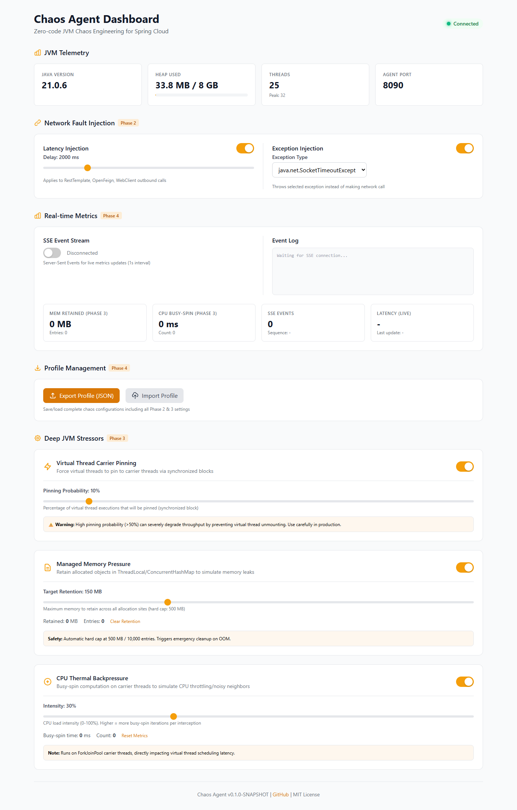

# my-chaos-agent

[](LICENSE)
[](https://openjdk.org/projects/jdk/21/)

**Flip a switch. Break your app. Learn how it survives.**

my-chaos-agent injects real chaos into your running JVM — latency, exceptions, memory pressure, CPU saturation, virtual-thread pinning — with **zero code changes and zero restarts**.



---

## What can you do with it?

| Scenario | Without agent | With agent |
|----------|---------------|------------|
| **🐌 Slow down external calls** | `POST /external` → 200 in 200ms | 200 in **2.2s** (2s injected) |
| **💥 Fail calls on demand** | `POST /external` → 200 OK | **HTTP 503** / SocketTimeout / ConnectException |
| **🧠 Simulate a memory leak** | Heap flat | Heap grows until you switch memory pressure off |
| **🔥 Saturate CPU** | Quiet | Busy-spin on carrier threads — CPU throttles like a noisy neighbor |
| **🧵 Pin virtual threads** | Full VT throughput | `synchronized` blocks pin carriers — watch your app crawl |

All of it via a **web dashboard** (`http://localhost:8090`) or a **REST API** — no code to write, no classpath pollution, no restart.

---

## How it works

1. **Attach** — start your app with one `-javaagent` flag (or attach to a running JVM via `agentmain`)
2. **Toggle** — open the embedded dashboard and flip switches / drag sliders
3. **Watch** — live SSE metrics show heap, threads, and every injected fault

Byte Buddy intercepts `RestTemplate`, `WebClient`, and `Feign` outbound calls — you don't touch a single line of your application.

---

## 🚀 Quick Start

```bash
git clone https://github.com/haipeng-guo-dev/my-chaos-agent.git
cd my-chaos-agent
mvn clean package -DskipTests
```

Run the sample app with the agent attached:

```bash
java -javaagent:agent-core/target/agent-core-0.1.0-SNAPSHOT.jar \
     -jar sample-spring-app/target/sample-spring-app-0.1.0-SNAPSHOT.jar
```

Open **http://localhost:8090** — toggle latency injection, then watch it in action:

```bash
# Baseline: fast
time curl http://localhost:8080/external

# Dashboard → Latency: 2000ms ON → now 2x slower
time curl http://localhost:8080/external
```

First-time setup? Java 21+ and Maven 3.9+.

---

## 🎮 Feature Overview

| Feature | What it does | Targets |
|---------|-------------|---------|
| **Latency Injection** | Add 0–10s delay to outbound calls | RestTemplate, WebClient, Feign |
| **Exception Injection** | Throw timeout / connect / HTTP 500/503/504 | RestTemplate, WebClient, Feign |
| **Carrier Pinning** | Pin virtual threads to carriers via `synchronized` | Any virtual-thread workload |
| **Memory Pressure** | Retain objects (capped 500 MB / 10k entries) to simulate leaks | JVM-wide |
| **CPU Backpressure** | Busy-spin on carrier threads (0–100%) | JVM-wide |
| **SSE Live Metrics** | Real-time heap / threads / fault counters | Dashboard |
| **Profile Export/Import** | Save & reload full chaos setups as JSON | Dashboard / API |

---

## 🎯 Why This Agent?

| Tool | JVM Fault Injection | Virtual Thread Pinning | Embedded Dashboard | Zero Classpath Pollution | Spring Cloud Native |
|------|---------------------|------------------------|--------------------|--------------------------|---------------------|
| **my-chaos-agent** | ✅ | ✅ **Unique** | ✅ | ✅ (shaded Byte Buddy) | ✅ RestTemplate, Feign, WebClient |
| Chaos Mesh / Litmus | ❌ (K8s-level only) | ❌ | ❌ | N/A | ❌ |
| Byteman | ✅ (rule-based) | ❌ | ❌ | ❌ | Manual rules |
| Arthas | ⚠️ (diagnostic-first) | ❌ | ✅ (separate) | ❌ | ❌ |
| JVM-Sandbox | ✅ | ❌ | ✅ | ❌ | Module required |
| ChaosBlade | ✅ | ❌ | ❌ | ❌ | Limited |
| Chaos Monkey | ❌ (abandoned) | ❌ | ❌ | ❌ | Spring Cloud 1.x only |

**Unique differentiators:**

- **🧵 Virtual Thread Carrier Pinning Simulator** — First tool to simulate `synchronized`/JNI pinning of virtual threads (Project Loom)
- **🌐 Embedded Dashboard** — Zero infrastructure; served directly from the agent at `http://localhost:8090`
- **📦 Zero Classpath Pollution** — Byte Buddy fully shaded/relocated to `com.chaosagent.shaded.*`
- **🔌 Runtime Attachable** — Attach to running JVM via `agentmain` (no restart needed)
- **☁️ Spring Cloud Native** — First-class interceptors for RestTemplate, OpenFeign, WebClient

---

## 🧪 Try the API (no dashboard needed)

```bash
# 2s latency on all outbound calls
curl -X POST http://localhost:8090/api/config \
  -H "Content-Type: application/json" \
  -d '{"latencyMs":2000,"latencyEnabled":true}'

# HTTP 503 on all outbound calls
curl -X POST http://localhost:8090/api/config \
  -H "Content-Type: application/json" \
  -d '{"exceptionEnabled":true,"exceptionType":"Http503"}'

# Enable all deep stressors at once
curl -X POST http://localhost:8090/api/config \
  -H "Content-Type: application/json" \
  -d '{"pinningEnabled":true,"pinningProbability":0.3,"memoryPressureEnabled":true,"memoryPressureMb":200,"cpuBackpressureEnabled":true,"cpuBackpressureIntensity":75}'

# Watch live metrics (SSE stream)
curl -N http://localhost:8090/api/metrics/stream
```

### Configuration schema

```json
{
  "latencyMs": 300,
  "latencyEnabled": true,
  "exceptionEnabled": false,
  "exceptionType": "SocketTimeoutException",
  "pinningEnabled": true,
  "pinningProbability": 0.2,
  "memoryPressureEnabled": true,
  "memoryPressureMb": 100,
  "cpuBackpressureEnabled": true,
  "cpuBackpressureIntensity": 50
}
```

### REST endpoints

```
GET  /api/status          # JVM telemetry (memory, threads, PID, version)
GET  /api/config          # Current chaos configuration
POST /api/config          # Update configuration (JSON)
GET  /api/metrics/stream  # SSE stream (text/event-stream)
GET  /api/profile         # Export current config as JSON file
POST /api/profile         # Import profile JSON, apply config
```

---

## 🔌 Attach to a Running JVM

No restart needed — attach directly:

```bash
# Find the target JVM
jps -l

# Attach the agent
java -cp agent-core/target/agent-core-0.1.0-SNAPSHOT.jar \
     com.chaosagent.agent.ChaosAgent <PID> [port=8090]
```

Custom port: `java -javaagent:agent-core.jar=port=9090 -jar app.jar`

---

## 🏗️ Architecture

```
┌─────────────────────────────────────────────────────────────────┐
│                        JVM Process                               │
├─────────────────────────────────────────────────────────────────┤
│  ┌──────────────────┐    ┌──────────────────────────────────┐  │
│  │  Application     │    │         Chaos Agent              │  │
│  │  (Spring Boot)   │    │  ┌────────────────────────────┐  │  │
│  │  • RestTemplate  │◄───┤  │ NetworkFaultInterceptor    │  │  │
│  │  • WebClient     │    │  │ • Latency/Exception Advice │  │  │
│  │  • Feign Client  │    │  └────────────────────────────┘  │  │
│  │  • @Async        │    │  ┌────────────────────────────┐  │  │
│  │  • Virtual Threads    │  │ CarrierPinningInterceptor  │  │  │
│  └────────┬─────────┘    │  │ • @ChaosPin / synchronized │  │  │
│           │              │  └────────────────────────────┘  │  │
│           │ Byte Buddy     │  ┌────────────────────────────┐  │  │
│           │ Instrumentation│  │ MemoryPressureInterceptor  │  │  │
│           ▼                │  │ • ThreadLocal retention    │  │  │
│  ┌──────────────────┐     │  │ • ConcurrentHashMap (capped)  │  │
│  │ Embedded         │     │  └────────────────────────────┘  │  │
│  │ HttpServer :8090 │     │  ┌────────────────────────────┐  │  │
│  │ • / (dashboard)  │     │  │ CpuBackpressureInterceptor │  │  │
│  │ • /api/*         │     │  │ • Busy-spin on carrier     │  │  │
│  │ • SSE /stream    │     │  └────────────────────────────┘  │  │
│  └──────────────────┘     └──────────────────────────────────┘  │
└─────────────────────────────────────────────────────────────────┘
```

### Key design decisions
- **Byte Buddy Shading**: `net.bytebuddy.*` → `com.chaosagent.shaded.*` — zero classpath pollution
- **Advice-based instrumentation**: minimal overhead, no generated subclasses
- **Static volatile config**: advice reads `ChaosConfig` directly, no config plumbing
- **Zero external dependencies**: agent uses only JDK stdlib + shaded Byte Buddy

---

## 🛡️ Safety

| Stressor | Safety mechanism |
|----------|------------------|
| Latency | Max 10s; disable instantly via dashboard/API |
| Exceptions | Outbound calls only; configurable types |
| Carrier pinning | Probability-based (default 10%); warning banner at >50% |
| Memory pressure | Hard cap: 500 MB / 10k entries; emergency OOM cleanup |
| CPU backpressure | Intensity 0–100%; carrier threads only |

**Production tips:** start low (latency < 500ms, pinning < 10%) → watch SSE stream → export a profile for repeatable experiments.

---

## 🧪 Sample App Endpoints

```
GET /hello              # Simple health check
GET /external           # RestTemplate → httpbin.org
GET /external-webclient # WebClient → httpbin.org
GET /external-feign     # Feign Client → httpbin.org
GET /health             # Spring Boot actuator health
```

---

## 🤝 Contributing

Fork → feature branch → commit → push → pull request. See [CONTRIBUTING.md](CONTRIBUTING.md).

## 📄 License

MIT — see [LICENSE](LICENSE).

## 🙏 Acknowledgments

[Byte Buddy](https://bytebuddy.net/) · [Spring Cloud OpenFeign](https://spring.io/projects/spring-cloud-openfeign) · [Project Loom](https://openjdk.org/projects/loom/)

---

**Built with ❤️ for the Java chaos engineering community.**